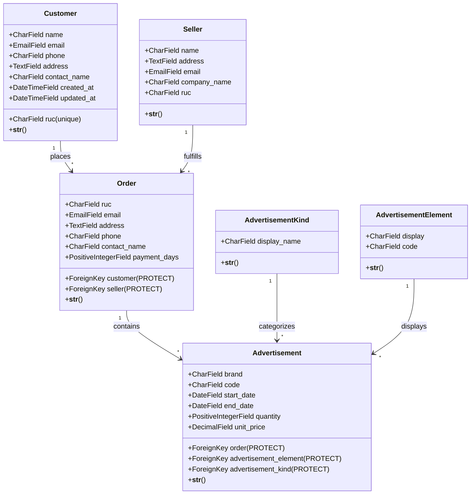
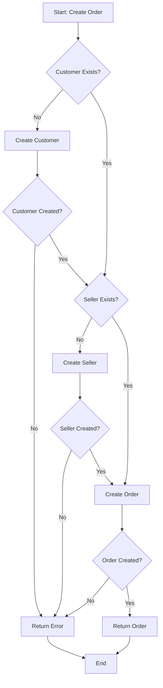
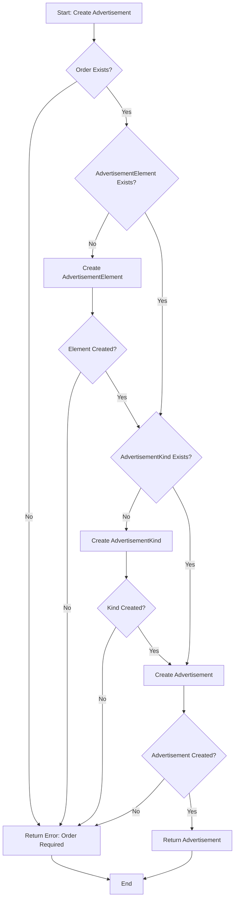
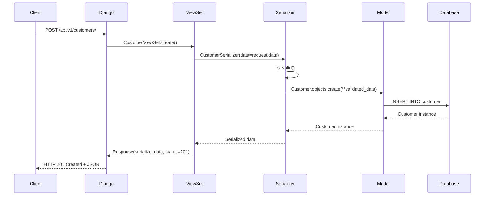
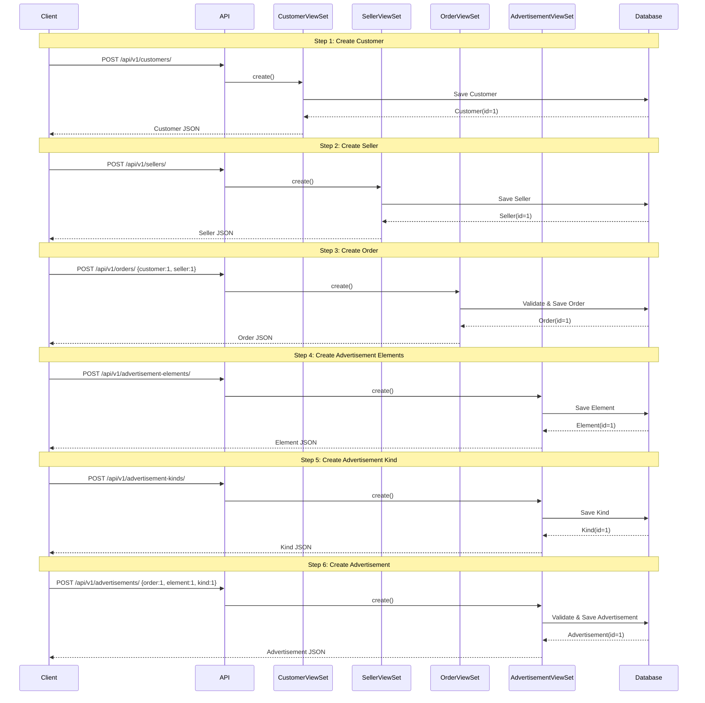

# Brave Orders

A Django REST Framework API application for managing orders, customers, sellers, and advertisements. This project provides a complete REST API with automatic OpenAPI documentation using drf-spectacular.

## Table of Contents

- [Features](#features)
- [Requirements](#requirements)
- [Installation](#installation)
- [Configuration](#configuration)
- [Database Setup](#database-setup)
- [Running the Server](#running-the-server)
- [API Documentation](#api-documentation)
- [Architecture](#architecture)
- [Usage Examples](#usage-examples)
- [Development](#development)

## Features

- **RESTful API** with Django REST Framework
- **Automatic API Documentation** with Swagger UI and ReDoc (drf-spectacular)
- **Nested Serializers** for creating Orders with Advertisements in a single request
- **Pagination** controlled by code (50 items per page by default, customizable up to 100)
- **Data Protection** using PROTECT foreign key constraints
- **Comprehensive Models**: Customers, Sellers, Orders, Advertisements, Advertisement Kinds, and Advertisement Elements
- **Full CRUD Operations** for all resources
- **Type-safe** with Python 3.13+ type hints and django-stubs
- **Fixtures** with initial data for Advertisement Kinds and Elements
- **27 Comprehensive Tests** covering all API endpoints including pagination
- **Code Quality** with pylint (10.00/10 score)

## Requirements

- Python 3.13 or higher
- PDM (Python Dependency Manager)
- Django 6.0+
- Django REST Framework 3.16.1+
- drf-spectacular 0.29.0+
- httpie (for CLI testing)

## Installation

1. **Clone the repository**:
   ```bash
   git clone <repository-url>
   cd brave-orders
   ```

2. **Set up Python environment** (using PDM):
   ```bash
   # Install PDM if not already installed
   pip install pdm

   # Install dependencies
   pdm install
   ```

3. **Activate the virtual environment**:
   ```bash
   # PDM creates a virtual environment automatically
   # Activate it using:
   source .venv/bin/activate  # On Unix/macOS
   # or
   .venv\Scripts\activate  # On Windows
   ```

## Configuration

The project uses Django's default settings. Key configurations:

- **Database**: SQLite (default, can be changed in `project/settings.py`)
- **API Base URL**: `/brave/orders/api/v1/`
- **Pagination**: Controlled by code via `StandardResultsSetPagination` class
  - Default: 50 items per page
  - Customizable: Use `?page_size=X` query parameter (max 100)
  - Page navigation: Use `?page=X` query parameter
- **API Documentation**: Available at `/brave/orders/api/v1/schema/swagger/` and `/brave/orders/api/v1/schema/redoc/`

## Database Setup

1. **Create migrations**:
   ```bash
   python manage.py makemigrations brave_orders
   ```

2. **Apply migrations**:
   ```bash
   python manage.py migrate
   ```

3. **Load initial fixture data** (optional, recommended):
   ```bash
   python manage.py loaddata brave_orders/fixtures/initial_data.yaml
   ```

   This will load:
   - 3 Advertisement Kinds (Publicidad, Espacios temporales, Sampling y volanteo)
   - 12 Advertisement Elements with unique codes

4. **Create a superuser** (optional, for Django admin):
   ```bash
   python manage.py createsuperuser
   ```

## Running the Server

Start the development server:

```bash
python manage.py runserver
```

The server will start on `http://localhost:8000/`

## API Documentation

Once the server is running, access the interactive API documentation:

- **Swagger UI**: http://localhost:8000/brave/orders/api/v1/schema/swagger/
- **ReDoc**: http://localhost:8000/brave/orders/api/v1/schema/redoc/
- **OpenAPI Schema**: http://localhost:8000/brave/orders/api/v1/schema/

## Architecture

### Class Diagram



### Order Creation Flow



### Advertisement Creation Flow



### API Request Sequence



### Complete Order Workflow Sequence



## Usage Examples

### Fixtures

The project includes initial fixture data for Advertisement Kinds and Advertisement Elements:

#### Load Fixtures

```bash
python manage.py loaddata brave_orders/fixtures/initial_data.yaml
```

This will load:
- **3 Advertisement Kinds**: Publicidad, Espacios temporales, Sampling y volanteo
- **12 Advertisement Elements**: Various banner types, LED screens, sampling locations, etc. with unique codes

### Using httpie CLI

#### 1. Create a Customer

```bash
echo '{
  "name": "Acme Corp",
  "ruc": "12345678901",
  "email": "contact@acme.com",
  "phone": "+1234567890",
  "address": "123 Main St",
  "contact_name": "John Doe"
}' | http POST http://localhost:8000/brave/orders/api/v1/customers/ \
  Content-Type:application/json
```

#### 2. List All Customers (Paginated)

```bash
# Default pagination (50 per page)
http GET http://localhost:8000/brave/orders/api/v1/customers/

# Custom page size (20 per page)
http GET 'http://localhost:8000/brave/orders/api/v1/customers/?page_size=20'

# Navigate to page 2
http GET 'http://localhost:8000/brave/orders/api/v1/customers/?page=2'

# Combine page and page_size
http GET 'http://localhost:8000/brave/orders/api/v1/customers/?page=2&page_size=30'
```

#### 3. Get a Specific Customer

```bash
http GET http://localhost:8000/brave/orders/api/v1/customers/1/
```

#### 4. Create a Seller

```bash
echo '{
  "name": "Jane Smith",
  "address": "456 Business Ave",
  "email": "jane@example.com",
  "company_name": "Tech Solutions Inc",
  "ruc": "98765432109"
}' | http POST http://localhost:8000/brave/orders/api/v1/sellers/ \
  Content-Type:application/json
```

#### 5. Create an Order

```bash
echo '{
  "customer": 1,
  "seller": 1,
  "ruc": "12345678901",
  "email": "order@example.com",
  "address": "123 Order St",
  "phone": "+1234567890",
  "contact_name": "Jane Doe",
  "payment_days": 30
}' | http POST http://localhost:8000/brave/orders/api/v1/orders/ \
  Content-Type:application/json
```

#### 6. Create Advertisement Components

```bash
# Create Advertisement Element (with code field)
echo '{"display": "Main Banner", "code": "BANNER-001"}' | \
  http POST http://localhost:8000/brave/orders/api/v1/advertisement-elements/ \
  Content-Type:application/json

# Create Advertisement Kind
echo '{"display_name": "Banner"}' | \
  http POST http://localhost:8000/brave/orders/api/v1/advertisement-kinds/ \
  Content-Type:application/json
```

#### 7. Create an Advertisement

```bash
echo '{
  "order": 1,
  "brand": "TechBrand",
  "code": "AD-2024-001",
  "start_date": "2024-01-01",
  "end_date": "2024-12-31",
  "quantity": 100,
  "unit_price": "50.00",
  "advertisement_element": 1,
  "advertisement_kind": 1
}' | http POST http://localhost:8000/brave/orders/api/v1/advertisements/ \
  Content-Type:application/json
```

#### 8. Update an Order (Partial)

```bash
echo '{"payment_days": 45}' | \
  http PATCH http://localhost:8000/brave/orders/api/v1/orders/1/ \
  Content-Type:application/json
```

#### 9. Delete a Resource

```bash
http DELETE http://localhost:8000/brave/orders/api/v1/customers/1/
```

#### 10. Create Order with Nested Advertisements

```bash
echo '{
  "customer": 1,
  "seller": 1,
  "ruc": "12345678901",
  "email": "order@example.com",
  "address": "123 Order St",
  "phone": "+1234567890",
  "contact_name": "Jane Doe",
  "payment_days": 30,
  "advertisements": [
    {
      "brand": "TechBrand",
      "code": "AD-2024-001",
      "start_date": "2024-01-01",
      "end_date": "2024-12-31",
      "quantity": 100,
      "unit_price": "50.00",
      "advertisement_element": 1,
      "advertisement_kind": 1
    }
  ]
}' | http POST http://localhost:8000/brave/orders/api/v1/orders/ \
  Content-Type:application/json
```

This creates an Order with nested Advertisements in a single request.

### Using Python httpx

```python
import httpx

BASE_URL = "http://localhost:8000/brave/orders/api/v1"

# Create a customer
customer_data = {
    "name": "Acme Corp",
    "ruc": "12345678901",
    "email": "contact@acme.com",
    "phone": "+1234567890",
    "address": "123 Main St",
    "contact_name": "John Doe"
}

with httpx.Client() as client:
    # Create a customer
    response = client.post(f"{BASE_URL}/customers/", json=customer_data)
    customer = response.json()
    print(f"Customer created: {customer['name']} (ID: {customer['id']})")

    # List all customers (paginated)
    response = client.get(f"{BASE_URL}/customers/")
    customers = response.json()
    print(f"Total customers: {customers['count']}")
    print(f"Results per page: {len(customers['results'])}")

    # Get specific customer
    customer_id = customer['id']
    response = client.get(f"{BASE_URL}/customers/{customer_id}/")
    customer_detail = response.json()
    print(f"Customer detail: {customer_detail}")

    # Update customer (partial)
    update_data = {"email": "newemail@acme.com"}
    response = client.patch(f"{BASE_URL}/customers/{customer_id}/", json=update_data)
    updated_customer = response.json()
    print(f"Updated email: {updated_customer['email']}")

    # Custom pagination
    response = client.get(f"{BASE_URL}/customers/", params={"page_size": 10})
    print(f"Custom page size: {len(response.json()['results'])} items")
```

#### Async Example with httpx

```python
import asyncio
import httpx

BASE_URL = "http://localhost:8000/brave/orders/api/v1"

async def main():
    async with httpx.AsyncClient() as client:
        # Create customer
        customer_data = {
            "name": "Async Corp",
            "ruc": "99988877766",
            "email": "async@example.com",
            "phone": "+9999999999",
            "address": "Async Street",
            "contact_name": "Async User"
        }
        response = await client.post(f"{BASE_URL}/customers/", json=customer_data)
        customer = response.json()
        print(f"Customer created: {customer['name']}")

        # List customers
        response = await client.get(f"{BASE_URL}/customers/")
        customers = response.json()
        print(f"Total customers: {customers['count']}")

# Run async function
asyncio.run(main())
```

## API Endpoints

All endpoints are prefixed with `/brave/orders/api/v1/`:

| Resource | Endpoint | Methods |
|----------|----------|---------|
| Customers | `/customers/` | GET, POST |
| Customers | `/customers/{id}/` | GET, PUT, PATCH, DELETE |
| Sellers | `/sellers/` | GET, POST |
| Sellers | `/sellers/{id}/` | GET, PUT, PATCH, DELETE |
| Orders | `/orders/` | GET, POST |
| Orders | `/orders/{id}/` | GET, PUT, PATCH, DELETE |
| Advertisements | `/advertisements/` | GET, POST |
| Advertisements | `/advertisements/{id}/` | GET, PUT, PATCH, DELETE |
| Advertisement Kinds | `/advertisement-kinds/` | GET, POST |
| Advertisement Kinds | `/advertisement-kinds/{id}/` | GET, PUT, PATCH, DELETE |
| Advertisement Elements | `/advertisement-elements/` | GET, POST |
| Advertisement Elements | `/advertisement-elements/{id}/` | GET, PUT, PATCH, DELETE |

## Response Format

All list endpoints return paginated responses:

```json
{
  "count": 150,
  "next": "http://localhost:8000/brave/orders/api/v1/customers/?page=2",
  "previous": null,
  "results": [
    {
      "id": 1,
      "name": "Acme Corp",
      "ruc": "12345678901",
      ...
    }
  ]
}
```

## Data Protection

The application uses `PROTECT` foreign key constraints to prevent accidental data deletion:

- **Customers** cannot be deleted if they have associated Orders
- **Sellers** cannot be deleted if they have associated Orders
- **Orders** cannot be deleted if they have associated Advertisements
- **AdvertisementElements** cannot be deleted if they have associated Advertisements
- **AdvertisementKinds** cannot be deleted if they have associated Advertisements

To delete protected resources, you must first delete all dependent resources.

## Development

### Code Quality

The project uses `pylint` for code quality checks. All Python files should pass with a score of 10.00/10:

```bash
pylint brave_orders/*.py project/*.py manage.py
```

The project also uses type hints with `typing` module and `django-stubs` for better type safety.

### Project Structure

```
brave-orders/
├── brave_orders/
│   ├── __init__.py
│   ├── models.py          # Django models
│   ├── serializers.py     # DRF serializers
│   ├── viewsets.py        # DRF viewsets
│   ├── pagination.py      # Pagination classes
│   ├── urls.py            # URL routing
│   ├── tests.py           # API tests (25 tests)
│   ├── admin.py           # Django admin configuration
│   ├── apps.py            # App configuration
│   ├── fixtures/          # Initial data fixtures
│   │   └── initial_data.yaml
│   └── migrations/        # Database migrations
│       └── 0001_initial.py
├── project/
│   ├── settings.py        # Django settings
│   ├── urls.py           # Root URL configuration
│   ├── wsgi.py           # WSGI configuration
│   └── asgi.py           # ASGI configuration
├── manage.py             # Django management script
├── pyproject.toml        # Project dependencies
└── README.md             # This file
```

### Running Tests

The project includes 27 comprehensive tests covering all API endpoints:

```bash
# Run all tests
python manage.py test brave_orders

# Run with verbose output
python manage.py test brave_orders -v 2

# Run specific test class
python manage.py test brave_orders.tests.OrderViewSetTestCase

# Run specific test method
python manage.py test brave_orders.tests.OrderViewSetTestCase.test_create_order_with_nested_advertisements
```

**Test Coverage:**
- ✅ Customer CRUD operations (6 tests)
- ✅ Seller CRUD operations (2 tests)
- ✅ Order CRUD operations with nested advertisements (6 tests)
- ✅ Advertisement CRUD operations (2 tests)
- ✅ AdvertisementKind CRUD operations (2 tests)
- ✅ AdvertisementElement CRUD operations (3 tests)
- ✅ Pagination (3 tests: default, custom page_size, max limit)
- ✅ Fixture data loading (3 tests)
```

### Creating Migrations

After modifying models:

```bash
python manage.py makemigrations brave_orders
python manage.py migrate
```

## License

AGPL-3.0-or-later

## Author

gcca (git@gcca.dev)
